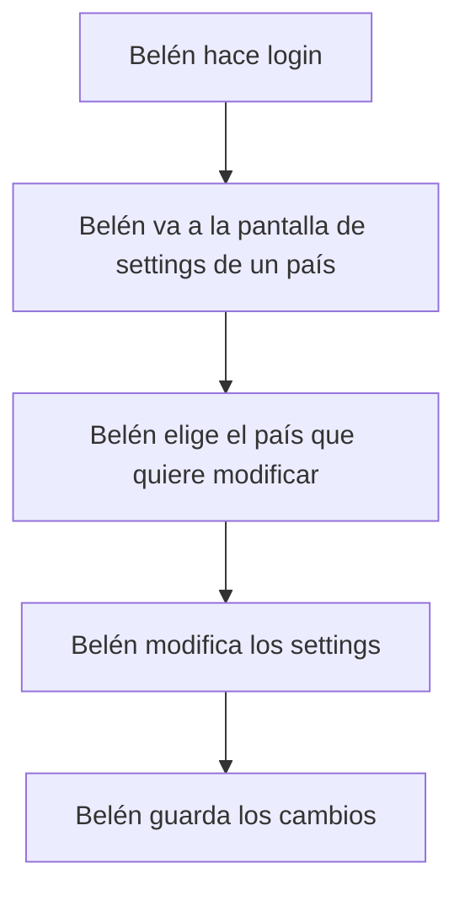

Negocio sabe de NEGOCIO !
Y tiene necesidades!
NECESITO UN SISTEMA QUE ME AYUDE A HACER MI TRABAJO.
¿Cual es tu trabajo? OBJETIVO... para qué?
¿Qué necesitas? NECESIDADES -> CASOS DE USO
    -> Ser capaz de modificar los settings de un país.
    -> Ser capaz de gestionar los providers de un país.
    -> Ser capaz de gestionar los bancos de un país, con sus sucursales.
    -> Ser capaz de generar ciertos informes.

Para llegar a eso, qué necesitas? REQUISITOS (Éstos se definen entre NEGOCIO, ANALISIS, UX, DESARROLLO, QA)
    QA: Es quién valida que el sistema cumple con los requisitos... y por ende debe verificar si esos requisitos están bien definidos y son comprobables.
    DESARROLLO: Es quién implementa los requisitos, y me debe dar viabilidad técnica.
    BUSINESS ANALYSIS: Es quién habla con el cliente... para entenderle. Sirve de intérprete entre el cliente y el equipo técnico.                          USEFUL
        Pero OJO !!!!! Eso es sólo la mitad del trabajo. Debo ser capaz de ir modelando el sistema!
    UX: Es quién se encarga de que el sistema sea usable. Debe entender al usuario y sus necesidades.                                                       USABLE
    NEGOCIO: Quién tiene la necesidad

    YAGNI: You Ain't Gonna Need It !
        De entrada no te lo hago... pero si en el futuro lo necesitas, y me lo pides 50 veces.. me lo pienso.

REQUISITOS: 
    FUNCIONALES -> FUNCIONALIDAD
        Debo tener un formulario con X Campos
    NO FUNCIONALES:
        USABILIDAD
            Debo tener un formulario con X Campos, pero que cuando alguien escriba algo mal, que le avise de ello.

---

Vuestro sistema actual:
- Está TOTALMENTE ORIENTADO A ENTIDADES en lugar de estar orientado a CASOS DE USO.
  Habéis puesto las tablas de ACCESS en una WEB.

  Paso por pantallas que no aportan valor (puedo hacer al usuario llegar a su cometido sin clic de ratón, mientras que en vuestro sistema para algunas operaciones BASICAS
  necesito al menos 3 clics... y pasar por pantallas que no aportan valor).

El listado que tenéis SOBRA COMPLETO. El ordenar columnas MAS.. El poner y quitar columnas.
Los formularios de filtros... prácticamente la mitad SOBRABAN.

---

- STORYBOARD nos ayuda a centrarnos en los CASOS DE USO.

    CASO DE USO:    Ser capaz de modificar los settings de un país
    USER PERSONA:   Belén

    1. A Belén le llega una petición (o la genera ella) para modificar los settings de un país.         PRISA !!!!
    2. Accede al sistema y va a la pantalla de settings de un país.
    3. Modifica los settings.
    4. Guarda los cambios.
    5. Está feliz.

    BELÉN Lo que quiere es acabar rápido, para poder hacer otra cosa.

Una vez hecho un STORYBOARD... que hemos tardado 2 minutos... ya tenemos una idea del objetivo del usuario.

Paso siguiente: FLUJO DE ACTIVIDAD

EN EL SISTEMA ACTUAL:

1. Belén hace login
2. Belén va a la pantalla de settings de un país
3. Belén elige el país que quiere modificar
-------
4. Darle al botón apply (EIN???)
5. En un listado que le sale en la pantalla, con sólo el país que ha seleccionado, ir al otro lado de la pantalla a apretar en el único botón que hay para ir a la vista de edición.
-------
7. En la vista de edición, modificar los settings
8. Guardar los cambios

---

Diseño de la información:
 PAIS
    SETTINGS
        Habrá que desglosarlos...  y agruparlos
    PROVIDERS
        SETTINGS
    BANKS
        SETTINGS
        SUCURSALES
            SETTINGS

De este trabajo sale: UI y BBDD y DESARROLLO

---

Desarrollo C# (.net core).
    Creamos clases. En programación, las clases atienden a distintas necesidades / tipos:
    - Controladores
    - Servicios
    - DTOs
    - Repositorios
    - ENTIDADES       ----> BBDD (DIAGRAMA ENTIDAD x relación)

Diagrama Entidad relación que es un subconjunto del diagrama de clases del proyecto.

---

En vuestro sistema actual:
PAIS
PROVIDERS
BANKS
LOCATIONS

---

## Competitor rates

### Casos de uso:

#### Caso 1: Gestión de request de competitor rates

Entra un request por parte de un agente y hay que analizarlo y en su caso:
- aportar información adicional
- modificarlo
- aprobarlo (cambio de rate): AUTOMÁTICO / MANUAL
- rechazarlo

El Actor: Es una persona muy técnica, muy formada, que pasa muchas horas con el sistema y que necesita mucha rapidez para hacer su trabajo.
 -> No importa una pantalla menos intuitiva (Se la aprende)
 -> Debe primar la rapidez por encima de todo (ATAJO, OPCIONES DELANTE). Tenemos cierto margen para cargarle la pantalla de cosas.

    USER PERSONA: Carlos

¿ Cuántas peticiones se estima que se reciban por unidad de tiempo ? No es lo mismo si tiene que hacer 1 de estas cada 5 minutos, cada minuto o cada hora.
¿Se te acumulan en un mismo periodo de tiempo o vienen a lo largo del día? INCOGNITA .. NO LO SABEMOS.. HEMOS DE AVERIGUARLO

##### StoryBoard: Happy path

1. Un agente emite una petición de cambio de rate mediante un sistema informatizado (no llamada de teléfono)
2. Carlos se entera de esa petición de forma rápida y sencilla.
3. Carlos analiza la petición y aporta información adicional si es necesario.
4. En caso que sea necesario, Carlos modifica la petición u otras peticiones RELACIONADAS
5. Toma una decisión sobre la misma (la aprueba o la rechaza) y/o sobre otras peticiones relacionadas.
6. Carlos ha acabado y está feliz. A por otra cosa!

PUNTOS CRITICOS:
- Carlos se debe enterar muy rápido de que tiene una petición pendiente.                            <<< Mandar un email, refrescar la pantalla rápido, notificación push
  Si no se entera rápido, Carlos se encabrona, con razón, porque le van a llamar la atención. 
- Carlos debe encontrar rápido la petición para gestionarla.
- Carlos debe poder tramitar ese request rápido... y para ello debe contar con información suficiente.

##### Flujo de actividad - Carlos están en un sitio X del sistema, que no es la pantalla de competitor rates (SI está en el entorno de 1 cada 10 minutos como mucho)

1. Un agente emite una petición de cambio de rate mediante un sistema informatizado (no llamada de teléfono)
2. Carlos está dentro del sistema haciendo sus otras movidas.
3. El sistema le debe avisar de que tiene una petición pendiente mediante un TOAST y BUBBLE en el apartado de notificaciones.
4. Carlos hace click en la notificación y se le lleva al request que debe gestionar;
   o hace click en las notificaciones y pulsa sobre la notificación del request que debe gestionar.
   o va directamente a la pantalla de competitor rates y allí tiene un listado de requests pendientes de gestionar.
                                                                        ^^^ EN ESTA PANTALLA... ponemos filtros? NO HACE FALTA deberían ser pocas...
                                                                            ORDENADAS? Por antigüedad / Por importancia (por el competidor)
                                                                                        ^^^^^^^^^^^^^^^^^^^^^^^^^^^^^
                                                                                        Fórmula para englobar ambos aspectos
5. Carlos llega a la pantalla de detalle del request y puede ver toda la información necesaria para tomar una decisión.
6. SI: Carlos considera que es necesario modificar la petición y/o otras peticiones relacionadas, lo debe poder hacer fácilmente
7. Carlos debe poder tomar una decisión sobre la petición y/o sobre peticiones relacionadas (aprobarla o rechazarla) de forma rápida y sencilla.
8. Carlos ha acabado y está feliz. A por otra cosa!

##### Arquitectura de la información

Lo que gestionamos son los rates para un agente desde una determinada moneda local ( A DIA DE HOY - Ni mañana, ni ayer )
    AGENT / CURRENCY FROM < BBDD (Fotografías)
        REQUEST!
            Información del request
                Fecha del request
                Origen del request
                ESTADO del request
            Información del agente/usuario/sistema que ha emitido la petición
                Código de agente / País
            Información del competidor
                Quién es el competidor / Rate actual / Rangos de cambio
            Información del rate  
                Currency FROM / Currency TO / Rate / Rango de cambio / Country To / Fecha / Correspondent / Delivery method
            Datos accesorios del request (justificar el request: FOTO DE LA TIENDA DE AL LADO, COMENTARIO)
            Información adicional para la toma de decisiones (Otros request pasados con información similar o relevante)
        Quizás hay un RATE para un Country to / Currency to / Correspondent / Delivery method que no tiene asociado un request, pero que quiero poder cambiar de paso... SIN REQUEST !

        ORIGEN:
        Mauricio ha pedido que su cambio de PESO MEXICANO A DOLAR ESTA JODIDO ... y necesita cambiarlo porque los de AMARILLO OFRECEN MEJOR TASA DE CAMBIO
        Mauricio quizás también ha pedido que le cambien el rate de PESO MEXICANO A EURO, porque los cabrones de AMARILLO también ofrecen mejor tasa de cambio.
        Y yo investigo (ANALISTA/TECNICO = CARLOS) y al hacerlo, veo que tiene razón... y le voy a cambiar esos rates.
            Pero en mi proceso identifico que el cambio a YENES también está jodido... pero MAURICIO no me ha pedido que lo cambie... No ha abierto un request.

        La tablita que saco abajo... no debe ser solamente de REQUEST ABIERTOS... sino que de alguna forma, debería yo CARLOS poder añadir dinámicamente un rate que no tiene request asociado para cambiarlo.

    OPERATIVA: 
        Carlos debe poder:
            - Modificar los datos del rate actual o los asociados a otros request relacionados
            - Aprobar o rechazar el request actual u otros request relacionados

##### Esqueleto de UI

#### Caso 2: ...

---

Tareas:
PRIORIDAD 1. Cuántos request de competitor rates se reciben por unidad de tiempo? y si se distribuyen uniformemente a lo largo del día o se acumulan en ciertos momentos.
PRIORIDAD 1: Identificar con el cliente la forma de ordenar las peticiones de cambio de rate. Yo intentaré convencerle de que para ellos es mejor que sea automático.
PRIORIDAD 1: Lo que gestionamos son:
    - Rates de un Agent/CurrencyFrom para el día de hoy?
    - Request de Rates de un Agent/CurrencyFrom para el día de hoy?

Notas:
- Si efectivamente lo que estamos gestionando son los rates del día de hoy, posiblemente el campo fecha del request no sea necesario mostrarlo.
