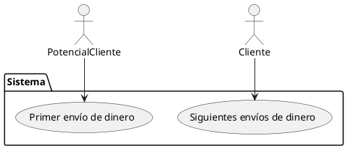

#  Casos de uso de la App para mandar dinero a otros paises.

```plantuml
@startuml
actor PotencialCliente as p
actor Cliente as c

package Sistema {
    usecase "Primer envío de dinero"        as c1
    usecase "Siguientes envíos de dinero"   as c2
}

p --> c1
c --> c2

@enduml
```