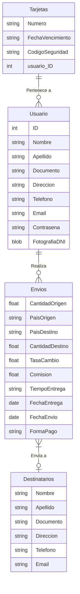

# Datos que necesito manipular

Datos del envío:
    - Cantidad de dinero Origen
    - País de origen                    AUTO
    - País de destino
    - Cantidad de dinero destino        AUTO
    - Tasa de cambio                    AUTO
    - Comisión                          AUTO
    - Tiempo de entrega                 AUTO
    - Fecha de entrega                  AUTO
    - Forma de pago
      - Tarjeta de crédito
        Datos de la tarjeta
    - Forma de entrega                  
    - Fecha de envío                    AUTO

Datos del destinatario:
    Nombre
    Apellido
    Número de documento de identidad
    Dirección
    Teléfono
    Email

Datos del remitente / usuario:
    Nombre
    Apellido
    Documento identidad
        Fotografía                      <<< MOVIDA
    Dirección
    Teléfono
    Email
    Contraseña
---

# Cómo los presento / obtengo del usuario
(Cómo los agrupo en la UI)

## Mete el dinero que quiere enviar

    - Cantidad de dinero Origen
    - País de origen                    AUTO
    - País de destino

## Cálculo del importe a recibir

    - ** Cantidad de dinero destino        AUTO **
        De alguna forma esta info incluye las otras: 
    - Tasa de cambio                    AUTO
    - Comisión                          AUTO

## Dato identificativo del usuario

    - Teléfono

## Datos del destinatario

    - Nombre
    - Apellido
    - Número de documento de identidad
    - Dirección
    - Teléfono
    - Email

# Resto de datos del usuario

    - Nombre
    - Apellido
    - Dirección
    - Teléfono
    - Email
    - Contraseña

# Resto de datos del usuario

    - Documento identidad
        Fotografía

# Resto de datos del envío

    - Forma de pago
      - Tarjeta de crédito
        Datos de la tarjeta
    - Forma de entrega                  
    - Fecha de envío                    AUTO
    - Tiempo de entrega                 AUTO
    - Fecha de entrega                  AUTO

---

# Cómo los guardo en la BBDD

