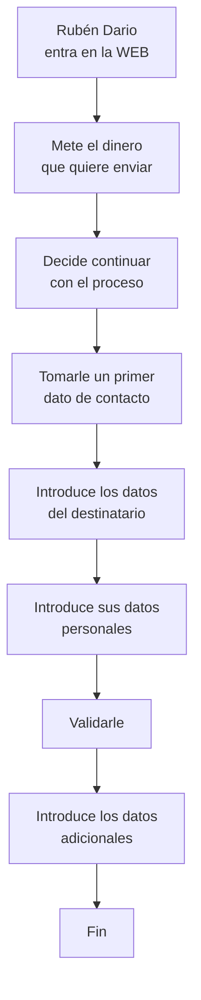

# Flujo de actividad:

- Primer envío de dinero
- Actor: Potencial Cliente
  User Persona: Rubén Darío

## Caso de uso:

1. Rubén Darío quiere enviar dinero a su familia en Colombia.
2. Rubén Darío ingresa a la web.
3. Rubén Darío consulta cuánto dinero llegará
4. Como le interesa continúa con el proceso.
5. Rubén Darío ha enviado el dinero y ESTA FELIZ !

## En ese fin:

Presentarle nuevos servicios / productos
Invitarle a conocer en detalle la funcionalidad de la web

Ese flujo de trabajo tendrá implicaciones a nivel de frontal y de backend... y si me apuras de BBDD

Si vengo de un sistema ya existente, puedo tener que adaptar el flujo de trabajo a lo que ya tengo en BBDD y backend.